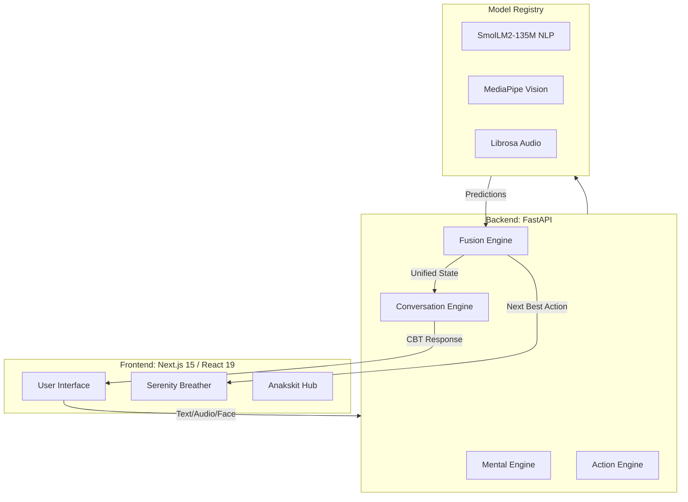

# MindfulAI: The Emotional Operating System (v2.5) 🧠✨

[](https://github.com/Aradhy20/mental-heath-ai/actions)
[](https://github.com/Aradhy20/mental-heath-ai)

**MindfulAI** is a state-of-the-art mental health platform designed to act as a continuous emotional support layer. By fusing real-time biometrics (Face & Voice) with deep linguistic analysis (Text), MindfulAI provides personalized, clinically-informed interventions for anxiety, stress, and burnout.

---

## 🏗️ System Architecture

MindfulAI follows a **Multimodal Intelligence** architecture, where disparate emotional signals are unified into a single "Resilience Score."



---

## 🚀 Key Features

### 🛡️ Anakskit (Anxiety Resilience Hub)
A high-priority module for acute anxiety management.
- **Thought Reframer**: Interactive CBT tool to identify "Thinking Traps" (Catastrophizing, Mind Reading).
- **5-4-3-2-1 Grounding**: Guided sensory sequence to halt panic attacks and dissociation.
- **Crisis Guard**: Immediate redirection to human professional care (988 integration) for high-risk detected states.

### 🌬️ Serenity Interactive Breather
A premium relaxation component with real-time visual guidance.
- **Modes**: Box Breathing (4x4), 4-7-8 Relax, and Equal Breathing.
- **Feedback**: Dynamic SVG animations built with Framer Motion to provide a calming visual anchor.

### 💬 Clinically-Informed AI Companion
A therapeutic agent powered by **SmolLM2** that switches between four specialized modes based on detected state:
- **SUPPORT**: Reflective listening and OARS validation.
- **CBT**: Cognitive restructuring and distortion detection.
- **COACHING**: Solution-focused brief therapy sessions.
- **CRISIS**: Emergency stabilization and psychological first aid.

---

## 💻 Technology Stack

### Frontend (Next.js 15 + React 19)
- **State Management**: [Zustand](https://github.com/pmndrs/zustand) (Atomic, high-performance state).
- **Animations**: [Framer Motion](https://www.framer.com/motion/) (Premium micro-interactions).
- **UI System**: Tailwind CSS with Radix UI and custom glassmorphism design.
- **Data Fetching**: Axios & React Query (Optimized caching).

### Backend (Python 3.9+ / FastAPI)
- **Main Framework**: [FastAPI](https://fastapi.tiangolo.com/) (Asynchronous micro-orchestration).
- **Database**: 
    - **MongoDB (Atlas)**: Unstructured emotional session logs.
    - **MySQL (Identity)**: Structured user profiles and authentication.
    - **Async Drivers**: `aiomysql` and `motor`.
- **AI/ML Model Registry**: 
    - **Transformers**: `SmolLM2-135M-Instruct` for local inference.
    - **Vision**: MediaPipe & OpenCV for facial landmark/emotion detection.
    - **Audio**: Librosa for prosody and stress feature extraction.

---

## 🛠️ Installation & Local Setup

MindfulAI is optimized for local execution using a unified orchestration script.

### 1. Prerequisites
- Node.js 18+ & npm
- Python 3.9+
- Local MySQL or MongoDB (Optional if using default .env)

### 2. Setup
```bash
# Clone the repository
git clone https://github.com/Aradhy20/mental-heath-ai.git
cd mental-heath-ai

# Install Backend Dependencies
cd backend
pip install -r requirements.txt

# Install Frontend Dependencies
cd ../frontend
npm install
```

### 3. Run Locally
We provide a master script to launch the full ecosystem in one command:
```bash
python3 run_all.py
```
- **Frontend**: http://localhost:3000
- **Backend API**: http://localhost:8001
- **API Docs**: http://localhost:8001/api/docs

---

## 📁 Repository Structure

| Directory | Purpose |
| :--- | :--- |
| `frontend/` | Next.js 15 Application, Resilience Hub, and UI Components. |
| `backend/main.py` | Unified FastAPI entry point and router orchestration. |
| `backend/ai/` | Core intelligence engines (Orchestrator, Safety, CBT, Memory). |
| `backend/ml/` | Training scripts and individual inference pipelines. |
| `backend/api/` | Sub-routers for Auth, Wellness, Chat, and Clinical Assessments. |
| `ai_models/` | Storage for pre-trained weights (Transformers, MediaPipe). |
| `data/` | Roboflow dataset for facial emotion training (v8-format). |
| `docs/` | System Requirements Specification (SRS) and Architecture logs. |

---

## 🔬 Technical Deep-Dive (v3.0)

### 1. The Intelligence Orchestrator (The Brain)
At the core of MindfulAI is a production-grade **Intelligence Orchestrator**. It manages the state across all sensors to ensure clinical safety and therapeutic effectiveness:
1.  **Sensor Fusion**: Aggregates Text, Voice, Face, and HRV biometrics.
2.  **Safety Triage (P0)**: Mandatory check against safety guardrails before any AI response.
3.  **Digital Twin Retrieval**: Fetches relevant long-term memories from ChromaDB.
4.  **Clinical Matching**: Identifies **Cognitive Distortions** (e.g., Catastrophizing).
5.  **Response Synthesis**: Generates empathetic, culturally-nuanced support.

### 2. Clinical Safety & Emergency Escalation
- **Safety Guardrails**: Filters AI advice to prevent unsafe or non-clinical guidance.
- **Crisis Escalator**: Real-time mapping of crisis signals to regional resources (988 US, 112 IND, 999 GBR).
- **UI Override**: The Chat interface automatically locks and renders an Emergency Overlay if a `CRITICAL` risk is detected.

### 3. Standardized Clinical Screening
MindfulAI now supports evidence-based measurement through integrated assessment tools:
- **PHQ-9**: Standardized screen for depression severity.
- **GAD-7**: Validated scale for generalized anxiety.
- **Automatic Scoring**: Real-time probability mapping and clinical categorization.

### 4. Multilingual Therapy Adaptation
The platform supports real-time language detection and cultural adaptation for:
- **Hindi** (Respectful, community-focused context)
- **Spanish** (Warm, social-connection focus)
- **Mandarin** (Balanced, harmony-focused context)

---

## 📈 Clinical Data Model
Our **Fusion Score** formula (v3.0):
```text
Resilience Score = (Text * 0.4) + (Audio * 0.2) + (Face * 0.15) + (HRV * 0.15) + (History * 0.1)
```
*Confidence weights are applied dynamically; if a modality is poor (e.g., low light for Face), its weight is redistributed to the primary sensors.*

---

## 📝 Disclaimer
MindfulAI is an AI-assisted support platform and **not a licensed medical service**. In case of a medical emergency or immediate self-harm risk, please contact professional emergency services immediately (e.g., dial 988 in the US/Canada).

---
*Developed with empathy by the MindfulAI Team.*
