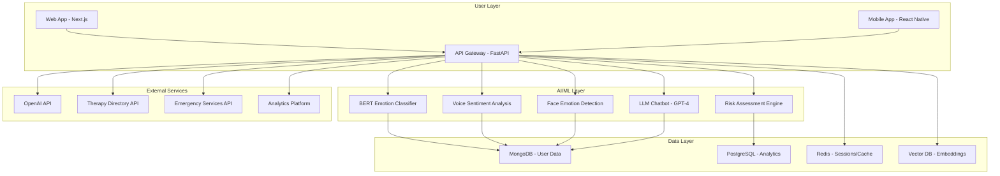

```mermaid
graph TB
    subgraph "User Layer"
        A[Web App - Next.js]
        B[Mobile App - React Native]
        C[API Gateway - FastAPI]
    end

    subgraph "AI/ML Layer"
        D[BERT Emotion Classifier]
        E[Voice Sentiment Analysis]
        F[Face Emotion Detection]
        G[LLM Chatbot - GPT-4]
        H[Risk Assessment Engine]
    end

    subgraph "Data Layer"
        I[MongoDB - User Data]
        J[PostgreSQL - Analytics]
        K[Redis - Sessions/Cache]
        L[Vector DB - Embeddings]
    end

    subgraph "External Services"
        M[OpenAI API]
        N[Therapy Directory API]
        O[Emergency Services API]
        P[Analytics Platform]
    end

    A --> C
    B --> C
    C --> D
    C --> E
    C --> F
    C --> G
    C --> H
    D --> I
    E --> I
    F --> I
    G --> I
    H --> J
    C --> K
    C --> L
    C --> M
    C --> N
    C --> O
    C --> P
```